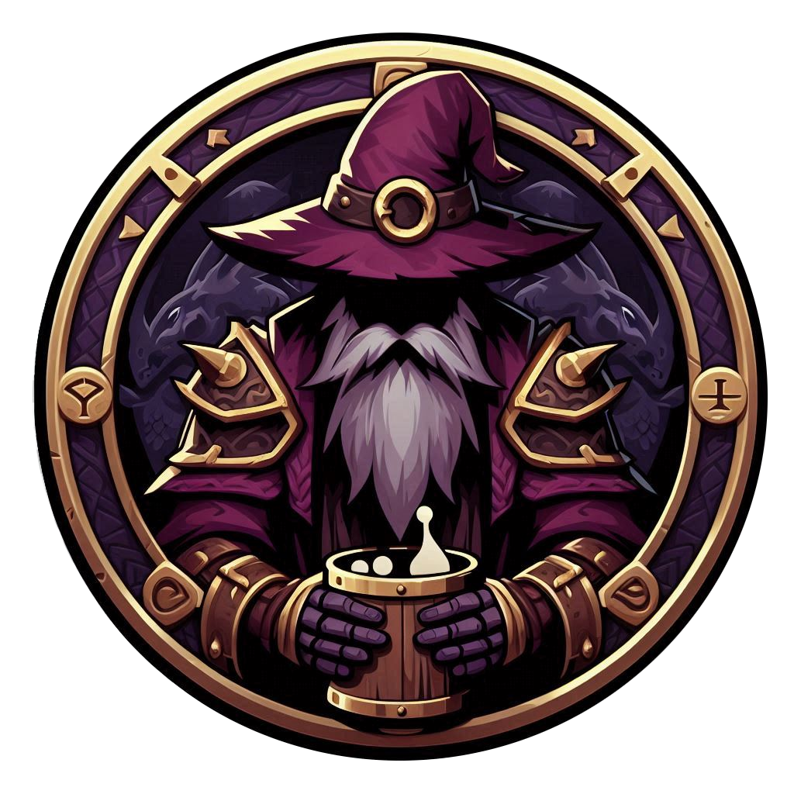

# Dados y Tragos

Proyecto web desarrollado en Java, JSP y Servlets que gestiona un bar temático.

## Tecnologías usadas
- **Java 21**
- **Maven**
- **Servlets y JSP**
- **MariaDB**
- **Bootstrap 5**
- **Tomcat 9**

## Estructura principal
```
DadosYTragos/
├── Consulta.sql
├── pom.xml
└── src/main/
    ├── java/com/svalero/dadosytragos/
    │   ├── dao/
    │   ├── database/
    │   ├── domain/
    │   ├── exception/
    │   └── servlet/
    └── webapp/
        ├── jsp/
        ├── css/
        ├── images/
        ├── includes/
        ├── META-INF/
        └── WEB-INF/
```

## Cómo levantar el proyecto
1. Clona el repositorio:
   ```bash
   git clone https://github.com/NereaTM/nereatm-dadosytragos.git
   ```
2. Configura tu base de datos con el script `Consulta.sql`.
3. Ajusta el archivo `Database.java` si cambias usuario o contraseña.
4. Usa Maven para desplegar:
    `mvn tomcat7:run` - Para levantar Tomcat.

## Funcionalidades principales
- Registro e inicio de sesión de usuarios con varios roles.
- CRUD completo de juegos, comidas, bebidas y usuarios.
- Buscador en todas las tablas.
- Paginación y validaciones de formularios.

## Docker
1. Cambiar el puerto de la base de datos de 3306 a 3307
2. Ejecutar docker compose
   ```bash
    docker compose up -d
     ```
2. Desplegar la aplicacion
   `mvn tomcat7:run`

3. Para poder apagar docker compose 
   ```bash
    docker compose down
     ```
   
---

<p align="center">
  
</p>
